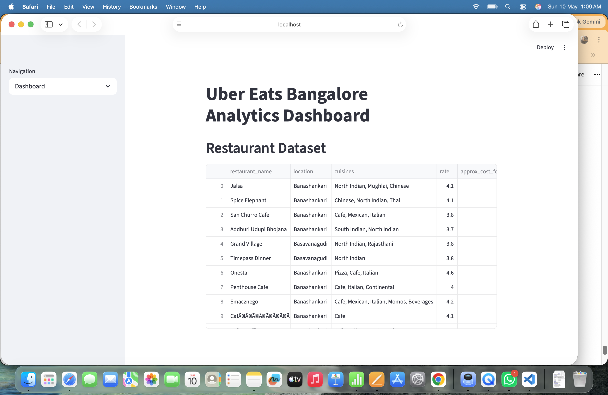
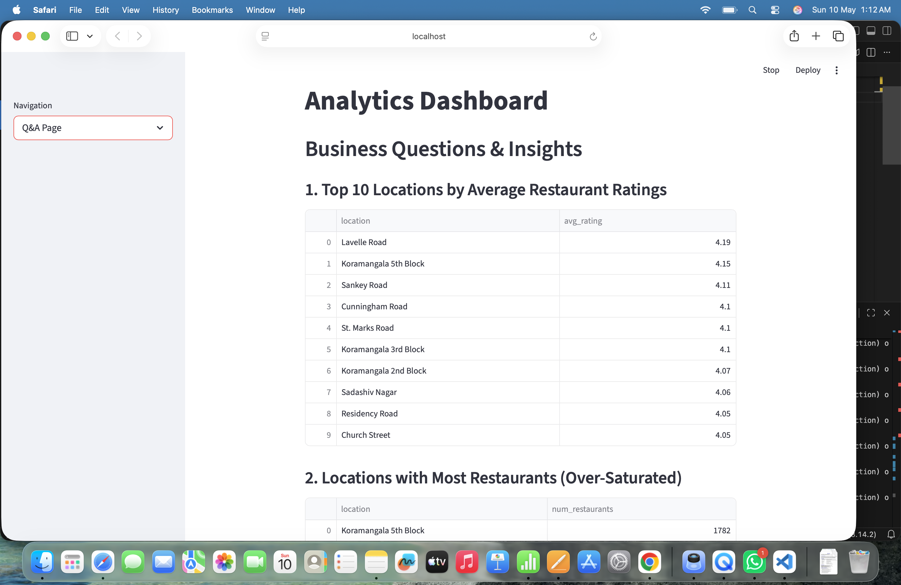
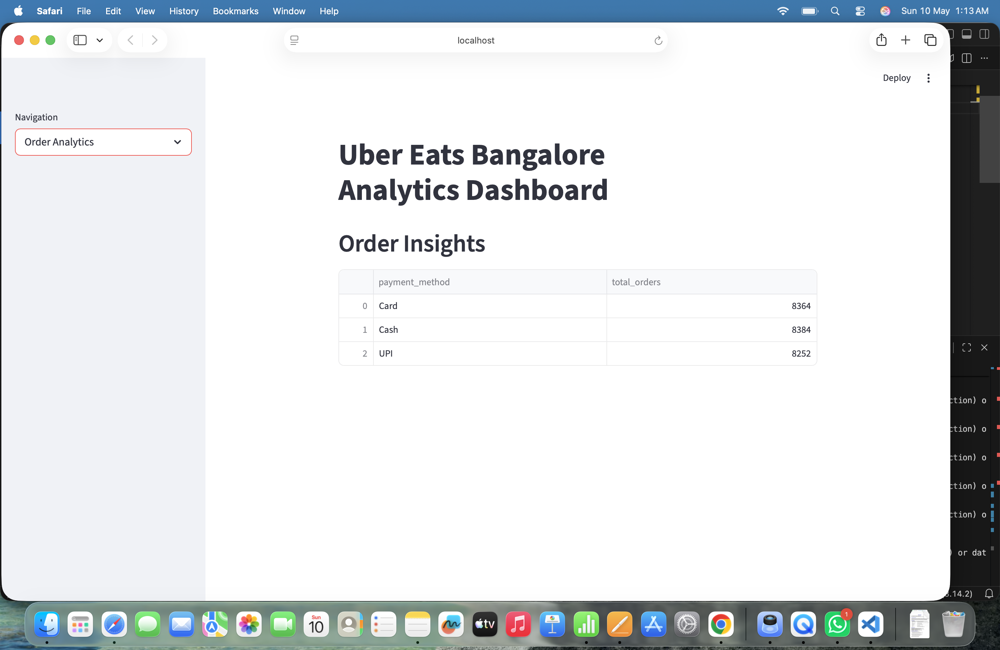

# Uber Eats Bangalore Restaurant Intelligence & Decision Support System

🔗 GitHub Repository:  
https://github.com/Monisha-12/uber_eats_analysis_project

---

# Project Overview

This project focuses on analyzing Uber Eats Bangalore restaurant data to build a Restaurant Intelligence and Decision Support System using Python, SQL, and Streamlit.

The system helps business stakeholders understand restaurant performance, customer satisfaction, pricing strategies, cuisine demand, and location intelligence using SQL-driven analytics.

The application displays business insights in tabular DataFrame format without using charts or visualizations, closely simulating real-world internal business dashboards.

---

# Problem Statement

Uber Eats operates a large-scale restaurant marketplace where business success depends on multiple factors such as:

- Restaurant location
- Pricing strategy
- Cuisine popularity
- Customer ratings
- Online ordering
- Table booking features

The goal of this project is to:

- Clean and organize restaurant data
- Store data in SQL database
- Perform SQL-based business analysis
- Build a Streamlit application for interactive business insights
- Support strategic decision-making using data

---

# Business Use Cases

- Location Intelligence
- Restaurant Expansion Planning
- Pricing Optimization
- Cuisine Performance Analysis
- Customer Satisfaction Analysis
- Online Ordering Impact Analysis
- Table Booking Impact Assessment
- Premium Restaurant Onboarding Strategy
- Market Segmentation
- Order Analytics

---

# Tech Stack

| Technology | Purpose |
|------------|---------|
| Python | Data Processing |
| Pandas | Data Cleaning & Analysis |
| MySQL | Database Management |
| Streamlit | Web Application |
| SQL | Business Query Analysis |
| JSON | Order Dataset |
| NumPy | Numerical Operations |

---

# Dataset Information

## Restaurant Dataset

The restaurant dataset contains information about Bangalore restaurants.

### Important Columns

| Column Name | Description |
|------------|-------------|
| restaurant_name | Restaurant Name |
| location | Restaurant Location |
| cuisines | Cuisine Types |
| rate | Customer Rating |
| approx_cost_for_two | Cost for Two People |
| online_order | Online Order Availability |
| book_table | Table Booking Availability |

---

## Order Dataset

The order dataset was provided in JSON format and converted into structured SQL tables for order analysis.

### Order Dataset Features

- Order ID
- Customer Name
- Restaurant Name
- Order Amount
- Delivery Status
- Payment Method
- Order Time

---

# Project Workflow

```text
Raw CSV + JSON Dataset
        ↓
Data Cleaning using Pandas
        ↓
Feature Engineering
        ↓
Store Cleaned Data in MySQL
        ↓
Execute SQL Queries
        ↓
Display Results in Streamlit

## Folder Structure

data/           → raw and processed datasets  
scripts/        → data cleaning and MySQL insertion  
streamlit_app/  → Streamlit dashboard

# Streamlit Screenshots
# Streamlit Screenshots

## Dashboard Page



## Business Q&A Page



## Order Analytics Page



## How to Run

1. Install requirements: `pip install -r requirements.txt`  
2. Clean CSV: `python scripts/data_cleaning.py`  
3. Insert restaurants: `python scripts/mysql_insert.py`  
4. Insert orders: `python scripts/json_to_sql.py`  
5. Run dashboard: `streamlit run streamlit_app/app.py`# uber_eats_analysis_project
